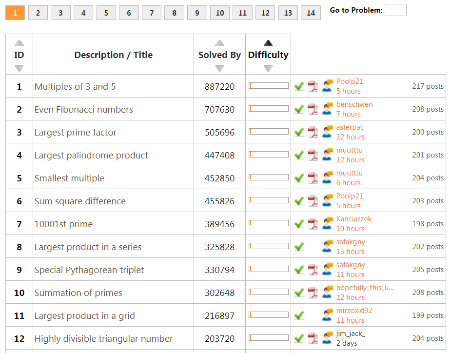

# Untitled

用欧拉计划学Rust编程

V1.1

## 题型介绍

欧拉计划中的各题都标出了难度系数，以百分数来表示，5%是其中难度最低的，难度最高的为100%，截止到2019年10月10日，难题系数为5%的题共有63道，可以作为Rust的入门练手题。

题目类型主要涉及整除性质、素数、因子、分数、回文数、阶乘、三角数、大整数、数字序列、路径计算、日期、全排列、组合数、初级密码学等方面，通过解这些题，可以了解Rust中的基本数据类型，向量用法，理解Rust中特有的所有权体系，体会函数式编程的思维等。

## 环境准备

在Windows下安装，用官网上的rustup直接默认安装即可。

安装完成之后，就有了《The Rust Programming Language》这本书的离线HTML版本，直接用命令打开：

rustup doc --book

还要会使用强大的包管理器：cargo

这个cargo好用的另人发指，建项目、编译、运行都用用它：

cargo new euler1

cd euler1

cargo build

cargo run

由于众所周知的原因，在国内访问rust官网有些慢，特别是你在build时需要从网站自动下载大量的依赖库时，会非常慢，最好换成国内的镜像服务器，中国科技大学就有这样的镜像服务器。修改办法是，找到Cargo安装的文件夹，编辑config文件，文件内容：

\[source.crates-io\]

registry = "https://github.com/rust-lang/crates.io-index"

replace-with = 'ustc'

\[source.ustc\]

registry = "git://mirrors.ustc.edu.cn/crates.io-index"

还有一个编码习惯检查的小工具：clippy，可以帮助你检查出来一些写得不太规范的地方，推荐使用。

安装：

rustup component add clippy

使用：

Cargo clippy

开发集成环境我推荐微软的vscode，安装rust相关的插件rls，为了将来的调试，还要安装C/C++支持。

调试程序的时候，首先打开vscode里的debug设置选项。

再打开菜单Debug -&gt; Add Configuration，平台选C/C++ \(Windows\)，此时需要编辑launch.json里的“program”属性，例如：

"program": "${workspaceFolder}/target/debug/my\_program.exe”,

## 小试牛刀

这一部分题型相对简单，可以了解Rust的基本数据类型，文件读取和字符串操作。

### 第1题 筛选整数

**问题描述：**

求小于1000的能被3或5整除的所有整数之和。

熟悉C语言和Python语言的朋友，可以很快写出来：

let mut sum = 0;

for i in 1..1000 {

 if i % 3 == 0 \|\| i % 5 == 0 {

 sum += i;

 }

}

println!\("{}", sum\);

mut关键字（mutable的缩写）是Rust的一大特色，所有变量默认为不可变的，如果想可变，需要mut关键字，否则在 sum += i 时会报编译错误。

for语句的写法与Python的写法类似，也类似C\#中的foreach的写法，没有C语言中的for\(int i=0; i&lt;1000; i++\)三段式写法。

println! 后面有一个叹号，表示这是一个宏，Rust里的宏也是非常非常强大！与C语言里的define完全不是一回事，以后再去了解宏的技术细节。

学过Python的列表推导（List Comprehension）语法的感觉这种题完全可以用一行语句搞定，Rust中需要用到filter\(\)和sum\(\)函数。

// 为了阅读，分成多行

println!\( "{}",

 \(1..1000\).filter\(\|x\| x % 3 == 0 \|\| x % 5 == 0\)

 .sum::&lt;u32&gt;\(\)

\);

.. 这个语法糖表示一个范围，需要注意这是一个开区间，上限不包含1000，如果想包含1000，需要这样写：\(1..=1000\)。

filter里面的\|x\|定义了一个闭包函数，关于闭包closure，又是一个复杂的主题，以后再逐步了解。

sum::\(\) 是一个范型函数，这种两个冒号的语法需要慢慢适应。

Rust的早期版本没有提供sum\(\)函数，需要用fold\(\)函数来实现，是这样写的：

println!\(

 "{}",

 \(1..1000\)

 .filter\(\|x\| x % 3 == 0 \|\| x % 5 == 0\)

 .fold\(0, \|s, a\| s + a\)

\);

用collect\(\)函数，可以把这些数全部打印出来。

println!\(

 "{:?}",

 \(1..1000\)

 .filter\(\|x\| x % 3 == 0 \|\| x % 5 == 0\)

 .collect::&lt;Vec&lt;u32&gt;&gt;\(\)

\);

// \[3, 5, 6, 9, 10, 12, ... 999\]

**语法知识点：**

* mut 表示可修改的变量
* println!宏的用法
* filter\(\)函数和sum\(\)函数

### 第2题 偶斐波那契数

**问题描述：**

400万之内所有偶数的斐波那契数字之和。

算法并不难，需要了解Rust中的向量的写法，这里的数列以\[1, 2\]开始，后面每个数是前面2个数字之和：

let mut fib = vec!\[1, 2\];

let mut i = 2; // 已经有2个元素

let mut sum = 2;

loop {

 let c = fib\[i - 1\] + fib\[i - 2\];

 if c &gt;= 4\_000\_000 {

 break;

 }

 fib.push\(c\);

 if c % 2 == 0 {

 sum += c;

 }

 i += 1;

}

println!\("{}", sum\);

这里没有使用函数式编程，大量使用了mut，无限循环用loop语法。

rust中关于整数的表示提供了多种数据类型，默认的整数类型是i32，默认浮点类型是f64。

数字类型中比较有特点的是可以用'\_'分隔符，让数字更容易读一些，还可以把u32, i64等类型作为后缀来指明类型。

let 赋值语句与其它语言也不一样，还可以改变其类型，这个特性为隐藏shadowing。

let x = 500u16;

let x = x + 1;

let x = 4\_000\_000\_u64;

let x = "slb";

这里的fib是一个向量，相当于其它语言里的数组、列表。用vec! 宏可以对向量进行初始化赋值。

这一行：

let mut fib = vec!\[1, 2\];

与下面三行等价：

let mut fib = Vec::new\(\);

fib.push\(1\);

fib.push\(2\);

push\(\)函数用于给列表增加一个元素。

还可以改进，利用rust的**延迟评价**特性，有起始值无终止值的无限序列可以用for语句搞定，原来的代码可以再精练一些，这种“2..”的语法在其它语言是无法想像的。

let mut fib = vec!\[1, 2\];

let mut sum = 2;

for i in 2.. {

 let c = fib\[i - 1\] + fib\[i - 2\];

 if c &gt;= 4\_000\_000 {

 break;

 }

 fib.push\(c\);

 if c % 2 == 0 {

 sum += c;

 }

}

println!\("{}", sum\);

如果再使用函数式编程，还可以更精练一点：

let mut fib = vec!\[1, 2\];

for i in 2.. {

 let c = fib\[i - 1\] + fib\[i - 2\];

 if c &gt;= 4\_000\_000 { break; }

 fib.push\(c\);

}

println!\("{}", fib.iter\(\).filter\(\|&x\| x % 2 == 0\).sum::&lt;u32&gt;\(\)\);

**语法知识点：**

* vec!宏进行向量初始化
* 往向量里增加一个元素用push\(\)函数
* \(2..\)无终止值的范围表示
* iter\(\)可以迭代生成向量里的所有元素

### 第3题 最大质因数

**问题描述：**

找出整数600851475143的最大素数因子。

素数就是只能被1和本身整除的数，首先定义一个函数is\_prime\(\)，用于判断是否为素数：

fn is\_prime\(num: u64\) -&gt; bool {

 for i in 2..\(num / 2 + 1\) {

 if num % i == 0 {

 return false;

 }

 }

 true

}

Rust是强类型语言，看到函数定义里的 -&gt; bool，这里可以看到Haskell语法的身影。

函数最后一行的true孤零零的，没有分号，让人感觉很奇怪。Rust是一个基于表达式的语言，一个语句块的最后可以是一个表达式，当然也可以用“return true;”表示。

现在可以查找最大的素数因子了：

let big\_num = 600851475143;

for i in \(2..=big\_num\).rev\(\) {

 if big\_num % i == 0 && is\_prime\(i\) {

 println!\("{}", i\);

 break;

 }

}

程序编译没问题，但几分钟也运行不出来结果，试着把数字调小一点，比如：600851，不到1秒出来结果，看来程序的效率太差了，主要原因在于判断素数的运算量太大，需要优化算法。

可以尝试把大数进行素数因子分解，找到一个素因子之后，可以用除法缩小搜索的范围，效率得到大幅提升，不到1秒得出结果。

let mut big\_num = 600851475143;

let mut max\_prime\_factor = 2;

while big\_num &gt;= 2 {

 for i in 2..=big\_num {

 if big\_num % i == 0 && is\_prime\(i\) {

 big\_num /= i;

 if i &gt; max\_prime\_factor {

 max\_prime\_factor = i;

 break;

 }

 }

 }

}

println!\("{}", max\_prime\_factor\);

Rust有丰富的函数库可供使用，使我们不用重复发明轮子，在primes函数库里有一个factors\_uniq\(\)函数，可以快速得到所有素数因子，主程序只需一条语句。

println!\("{:?}", primes::factors\_uniq\(600851475143\).last\(\).unwrap\(\)\);

### 第4题 最大回文乘积

**问题描述：**

所谓回文数，就是两边读都一样的数，比如：698896。

求两个3位数之积最大的回文数。

先写一个判断回文数的函数：

fn is\_palindromic\(n: u64\) -&gt; bool {

 let s = n.to\_string\(\);

 s.chars\(\).rev\(\).collect::&lt;String&gt;\(\) == s

}

把数字转换成字符串，再把字符串反序，如果与原字符串一样，则是回文数。

Rust中字符串的反序操作好奇怪，竟然不是s.rev\(\)，先要用chars\(\)函数，我google搜索到了上面那个代码片段。

剩下的逻辑并不复杂，用两重循环可以快速搞定。

let mut max = 0;

for x in 100..=999 {

 for y in 100..=999 {

 let prod = x \* y;

 if is\_palindromic\(prod\) && prod &gt; max {

 max = prod;

 // println!\("{} x {} = {}", x, y, prod\);

 }

 }

}

println!\("{}", max\);

我一开始以为只要反序搜索就可以快速找到答案，但找到的数并不是最大，你能发现问题之所在吗？不过，从这个错误代码中，我学会了双重循环如何跳出外层循环的语法。真是没有白走的弯路。

// 错误代码

'outer: for x in \(100..=999\).rev\(\) {

 for y in \(100..=999\).rev\(\) {

 let prod = x \* y;

 if is\_palindromic\(prod\) {

 println!\("{} x {} = {}", x, y, prod\);

 break 'outer;

 }

 }

}

**语法知识点：**

字符串的反序用s.chars\(\).rev\(\).collect::&lt;String&gt;\(\)

### 第5题 最小倍数

**问题描述：**

找出能够被1, 2, 3, ..., 20整除的最小整数。

代码逻辑很简单，一个一个尝试整除，找到后跳出最外层循环。

'outer: for x in \(100..\).step\_by\(2\) {

 for f in \(2..=20\).rev\(\) {

 if x % f != 0 {

 break;

 }

 if f == 2 {

 println!\("{}", x\);

 break 'outer;

 }

 }

}

如果你感觉程序运行效率不够高，可以用下面这个命令行运行，差别还是非常大的，感觉与C程序的效率相媲美：

cargo run –release

上面为了跳出外部循环，专门加了一个标签，逻辑上感觉怪怪的，可以先定义一个函数。

// 一个数是否可以被1到20整除

fn can\_divide\_1\_to\_20\(x: u64\) -&gt; bool {

 for f in \(2..=20\).rev\(\) {

 if x % f != 0 {

 return false;

 }

 }

 true

}

主程序的代码的逻辑就清晰多了。

for x in \(100..\).step\_by\(2\) {

 if can\_divide\_1\_to\_20\(x\) {

 println!\("{}", x\);

 break;

 }

}

熟悉函数式编程的，还可以写成一行：

print!\("{}", \(100..\).step\_by\(2\).find\(\|&x\| can\_divide\_1\_to\_20\(x\)\).unwrap\(\)\);

### 第6题 平方和与和的平方之差

**问题描述：**

求1到100自然数的“和的平方”与“平方和”的差。

用普通的过程式编程方法，这题没有难度，但要尝试一下函数式编程思路，代码会异常简洁。

let sum\_of\_squares = \(1..=100\).map\(\|x\| x\*x\).sum::&lt;u32&gt;\(\);

let square\_sum = \(1..=100\).sum::&lt;u32&gt;\(\).pow\(2\);

println!\("{}", square\_sum - sum\_of\_squares\);

Rust的较早版本没有提供sum\(\)函数，要用fold\(\)函数曲折实现，理解起来稍微困难一些：

let sum\_of\_squares = \(1..=100\).fold\(0, \|s, n\| s + n \* n\);

let square\_sum = \(1..=100\_u64\).fold\(0, \|s, n\| s + n\).pow\(2\);

println!\("{}", square\_sum - sum\_of\_squares\);

### 第8题 连续数字最大乘积

**问题描述：**

在1000位的大整数里找到相邻的13个数字，使其乘积最大。

首先系统内建的u32, u64或u128整数肯定无法保存1000位的大整数，我们用字符串来表示这个大整数，为了让代码好看些，用数组表示，并用concat\(\)函数合并。

let digits = vec!\[  
 "73167176531330624919225119674426574742355349194934",  
 "96983520312774506326239578318016984801869478851843",  
 "85861560789112949495459501737958331952853208805511",  
 "12540698747158523863050715693290963295227443043557",  
 "66896648950445244523161731856403098711121722383113",  
 "62229893423380308135336276614282806444486645238749",  
 "30358907296290491560440772390713810515859307960866",  
 "70172427121883998797908792274921901699720888093776",  
 "65727333001053367881220235421809751254540594752243",  
 "52584907711670556013604839586446706324415722155397",  
 "53697817977846174064955149290862569321978468622482",  
 "83972241375657056057490261407972968652414535100474",  
 "82166370484403199890008895243450658541227588666881",  
 "16427171479924442928230863465674813919123162824586",  
 "17866458359124566529476545682848912883142607690042",  
 "24219022671055626321111109370544217506941658960408",  
 "07198403850962455444362981230987879927244284909188",  
 "84580156166097919133875499200524063689912560717606",  
 "05886116467109405077541002256983155200055935729725",  
 "71636269561882670428252483600823257530420752963450",  
\].concat\(\);

找到相邻的13个数字，需要用到字符串的切片\(slice\)功能，比如找到从i开始的13个字符形成了一个子串。这里面的“&”符号是容易出错的地方，digits变量有所有权，如果被借用后，就不能再被使用，熟悉C++的朋友，可以把“&”理解为引用，这样不破坏原来的所有权。

let x = &digits\[i .. i + 13\];

现在需要用到函数式编程的思路，将13个字符分离出来，并转换成数字，再相乘起来，用到chars\(\), map\(\), to\_digit\(\), unwrap\(\), fold\(\)等一连串的函数，请自行体会。

x.chars\(\)  
 .map\(\|**c**\| **c**.to\_digit\(10\).unwrap\(\)\)  
 .fold\(1\_u64, \|**p**, a\| **p** \* a as u64\);

to\_digit\(10\) 可用于将字符转换为数字，例如'9'转换为9，需要注意这里的转换有可能出现异常，而rust处理异常的方式很特别，要重点学习 Option&lt;T&gt; 的用法。

用unwrap\(\)函数可以将Option&lt;u64&gt;类型转换成u64类型。

最后的代码是这样：

const **ADJACENT\_NUMBERS**: usize = 13;

**let** mut max = 0;  
**for** i **in** 0..digits.len\(\) - **ADJACENT\_NUMBERS** {  
 **let** x = &digits\[i..i + **ADJACENT\_NUMBERS**\];  
 **let** prod = x  
 .chars\(\)  
 .map\(\|c\| c.to\_digit\(10\).unwrap\(\)\)  
 .fold\(1\_u64, \|p, a\| p \* a **as** u64\);  
 **if** prod &gt; max {  
 println!\("index: {} x: {} prod: {}", i, x, prod\);  
 max = prod;  
 }  
}

### 第17题 表达数字的英文字母计数

**问题描述：**

1到1000用英文单词写下来，求总字符个数（空格和连字符不算），例如：342，英文单词是：three hundred and forty-two。

**问题分解：**

1）数字转换成英文单词

1.1）1到19的拼写

1.2）20到99的拼写

1.3）100到999的拼写

1.4）1000的拼写

2）单词中去掉空格和连字符

3）求字符总数

1到19的拼写比较特殊，需要分别对待，而超过20的数，可以利用递归调用。这里可以学到String的语法知识点。Rust中的字符串有点烦人，list\[n\].to\_string\(\)、"one thousand".to\_string\(\)的这种写法让人非常不适应。除了String之外，还有字符串切片\(slice\)、字符常量，需要看基础教程慢慢理解。

**fn** **english\_number**\(n: usize\) -&gt; String {  
 **let** list0\_9 = vec!\[  
 "zero", "one", "two", "three", "four",  
 "five", "six", "seven", "eight", "nine",  
 \];  
 **if** n &lt;= 9 {  
 **return** list0\_9\[n\].to\_string\(\);  
 }  
 **if** n &lt;= 19 {  
 **let** list = vec!\[  
 "ten", "eleven", "twelve", "thirteen", "fourteen",  
 "fifteen", "sixteen", "seventeen", "eighteen", "nineteen",  
 \];  
 **return** list\[n - 10\].to\_string\(\);  
 }  
 **if** n &lt;= 99 {  
 **let** a: usize = n / 10; _// 十位_  
 **let** b: usize = n % 10;  
 **let** list = vec!\[  
 "", "", "twenty", "thirty", "forty",  
 "fifty", "sixty", "seventy", "eighty", "ninety"  
 \];  
 **let** str = list\[a\].to\_string\(\);  
 **if** b &gt; 0 {  
 **return** str + "-" + &english\_number\(b\);  
 }  
 **return** str;  
 }  
 **if** n &lt;= 999 {  
 **let** a: usize = n / 100; _// 百位_  
 **let** b: usize = n % 100;  
 **let** str = list0\_9\[a\].to\_string\(\) + " hundred";  
 **if** b &gt; 0 {  
 **return** str + " and " + &english\_number\(b\);  
 }  
 **return** str;  
 }  
 **if** n == 1000 {  
 **return** "one thousand".to\_string\(\);  
 }  
 **return** "unknown".to\_string\(\);  
}

从字符串里移除特定的字符，要利用函数式编程，还有filter\(\)和collect\(\)函数，一气呵成。filter\(\)函数中的\*c又是让人容易写错的地方。

**fn** **remove\_space**\(s: &str\) **-**&gt; **String** {  
 **s**.chars\(\).filter\(\|c\| \*c != ' ' && \*c != '-'\).collect\(\)  
}

主程序就比较容易了，求和即可。

**let** mut sum = 0;  
**for** n in 1..=1000 {  
 **let** s = remove\_space\(&english\_number\(n\)\);  
 sum += s.len\(\);  
 // println!\("{}: {} {}", n, english\_number\(n\), s.len\(\)\);  
}  
println!\("{}", sum\);

### 第22题 姓名得分

**问题描述：**

从文件中读取一堆名字，按字母顺序排序，求名字分总和。名字分 = 顺序号 \* 名字中几个字母的序号和。

例如：COLIN，所有字符在字母表中的序号之和，3 + 15 + 12 + 9 + 14 = 53，COLIN名字排在第938个，该名字的得分为938 × 53 = 49714。

问题分解：

1）读文件，移除引号

2）把名字存储在Vec向量中

3）排序

4）求字符在字母表中的序号

5）求单词的分数

6）求总分

正式开始

1）首先把文件读到一个字符串中。

use std::fs;

fn main\(\) {  
 let data = fs::read\_to\_string\("names.txt"\)  
 .expect\("读文件失败"\);  
 println!\("{}", data\);  
}

名字中都带着引号，需要移除，可以利用函数式编程，还有filter\(\)和collect\(\)函数，一气呵成。filter\(\)函数中的\*c又是让人容易出错的地方。

fn remove\_quote\(s: &str\) -&gt; String {  
 s.chars\(\).filter\(\|c\| \*c !='"'\).collect\(\)  
}

2）每个名字是用逗号分开的，所以可以用split\(\)函数，分解成向量。

let data2 = remove\_quote\(&data\);  
let names: Vec&lt;&str&gt; = data2.split\(","\).collect\(\);  
println!\("{:?}", names\);

3）向量有专门的排序函数，需要将变量定义为可修改的。

let mut names: Vec&lt;&str&gt; = data2.split\(","\).collect\(\);names.sort\(\);

4）字符在字母表中的顺序号，可以求find\(\)，也可以用position\(\)函数。

fn letter\_number\(ch: char\) -&gt; usize {  
 let letters = "ABCDEFGHIJKLMNOPQRSTUVWXYZ";  
 letters.chars\(\).position\(\|c\| c == ch\).unwrap\(\) + 1  
}

5）求一个单词的分数

fn word\_score\(word: &str\) -&gt; usize {  
 let mut score = 0;  
 for ch in word.chars\(\) {  
 score += letter\_number\(ch\);  
 }  
 score  
}

6）现在可以求总分了，有一个非常有用的for循环的用法，可以既得到元素，还可以得到元素的索引号，利用enumerate\(\)函数。

let mut score = 0;  
for \(i, name\) in names.iter\(\).enumerate\(\) {  
 let ws = word\_score\(name\);  
 println!\("{} {} {}", \(i+1\), name, ws\);  
 score += ws \* \(i + 1\);  
}  
println!\("{}", score\);

完整的main\(\)代码：

let data = std::fs::read\_to\_string\("names.txt"\).expect\("读文件失败"\);  
let data2 = remove\_quote\(&data\);  
let mut names: Vec&lt;&str&gt; = data2.split\(","\).collect\(\);

names.sort\(\);  
let mut score = 0;  
for \(i, name\) in names.iter\(\).enumerate\(\) {  
 let ws = word\_score\(name\);  
 println!\("{} {} {}", \(i + 1\), name, ws\);  
 score += ws \* \(i + 1\);  
}  
println!\("{}", score\);

语法点：

* std::fs读文件
* 字符串的split\(\)函数
* 排序函数sort\(\)
* 字符串中查找一个字符的位置
* enumerate\(\)迭代器，可以产生序号和元素

